1. Cari AWS
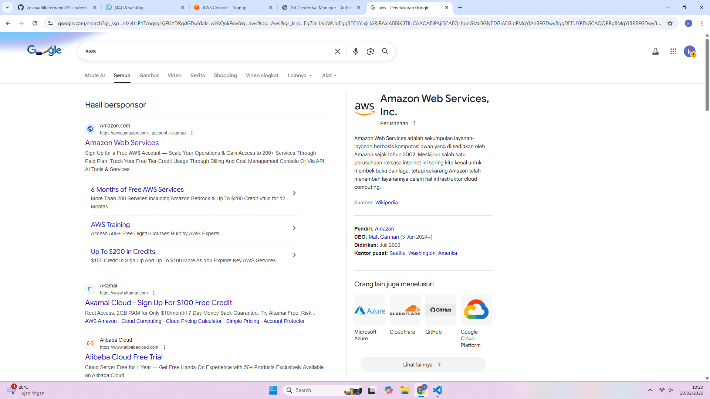

2.Klik pada bagian a create free account
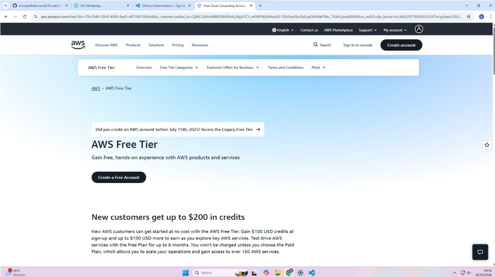

3. Masukkan dengan menggunakan email + usern kalian
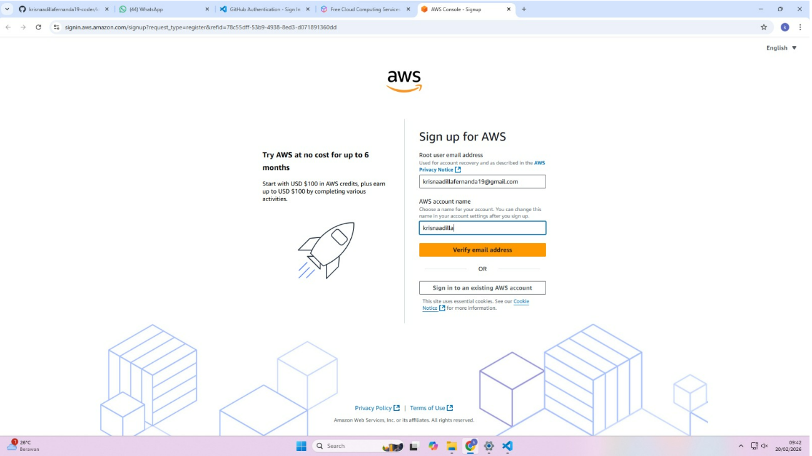

4. Pilih yang bagian sebelah kiri (choose free plan)
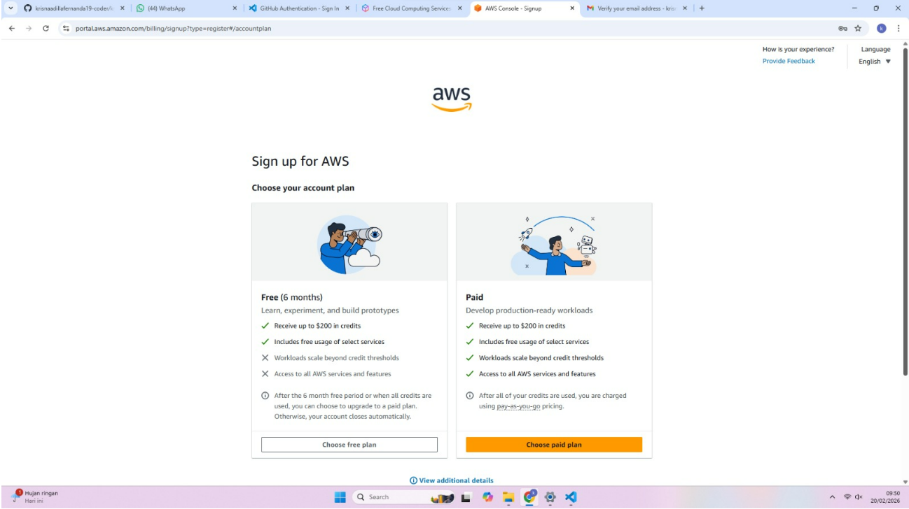

5. Isi data diri lengkap dari nama hingga alamat
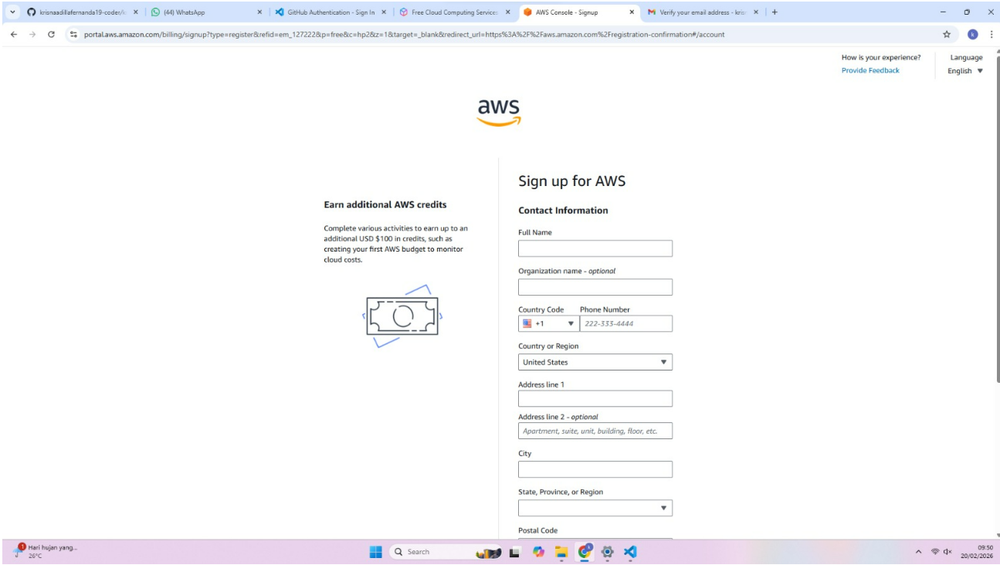

6. Isi bagian rek BANK menggunakan BANK JAGO
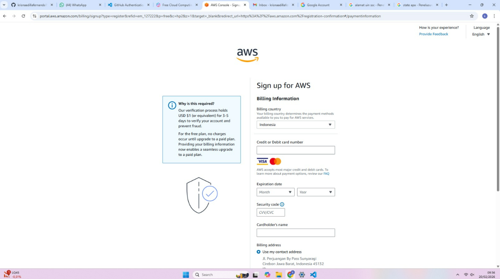

7. Tunggu notif konfirmasi di BANK JAGO, lalu klik konfirmasi
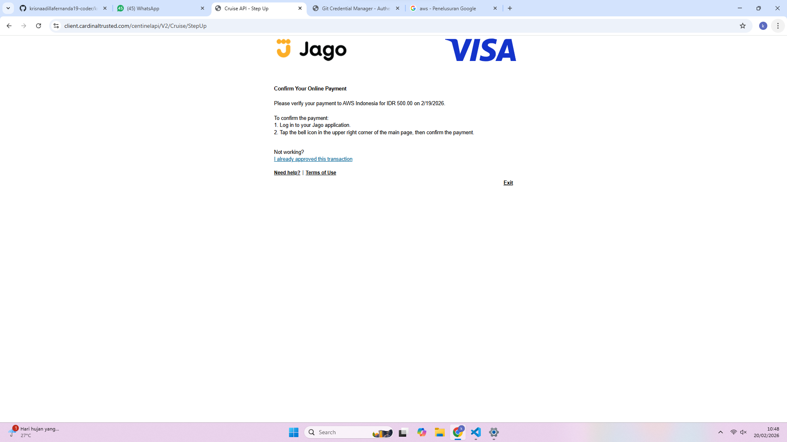

8. Atur negara Anda dan masukkan no. telp aktif
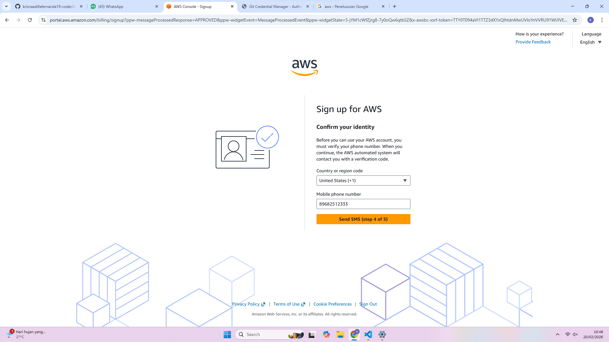

9. Masukkan kode dari SMS
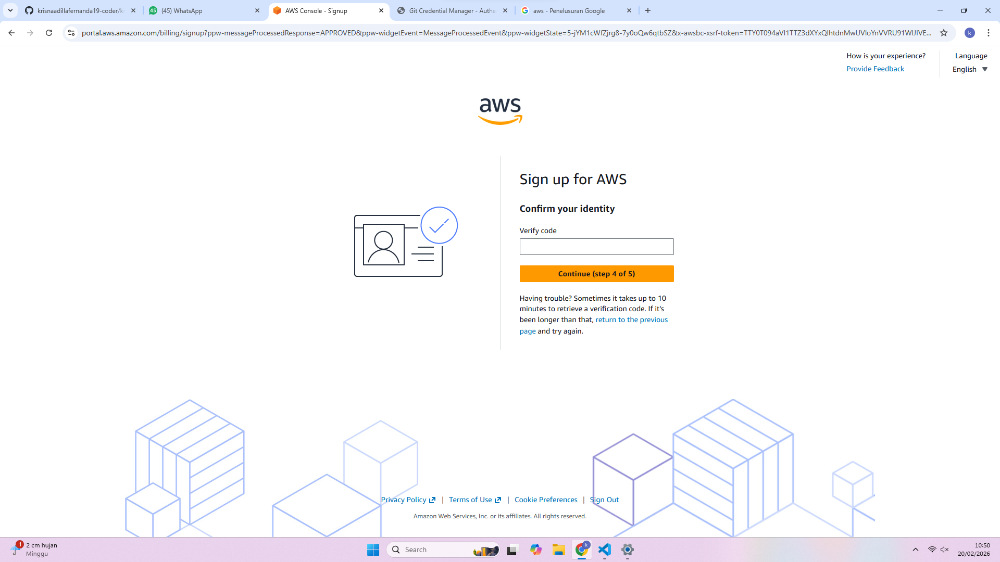

10. Nah tampilan akan seperti ini, namun ini tuh delay harusnya tidak merah seperti ini
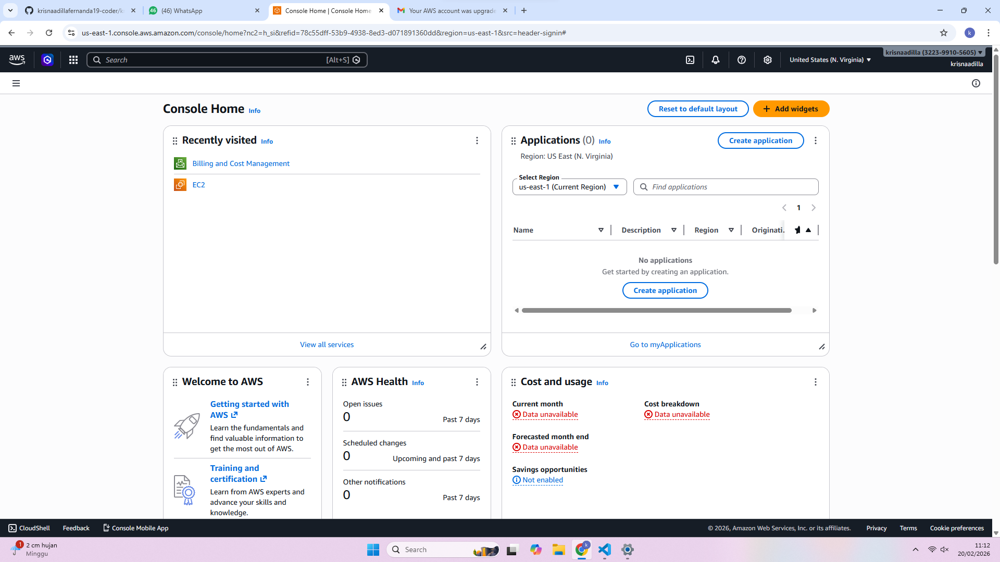

11. Klik nama username kalian dipojok kanan, lalu klik billing cost and managemant
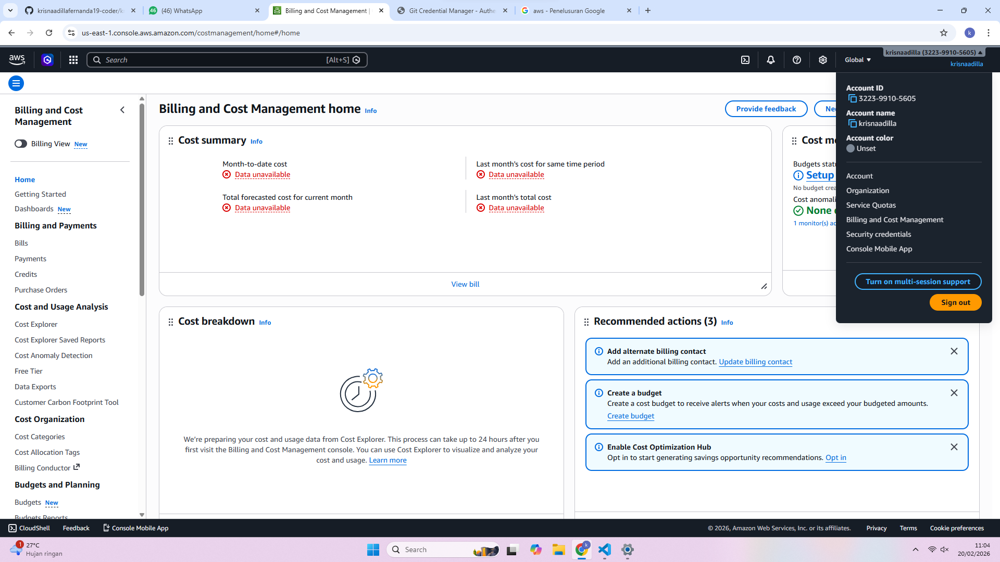
